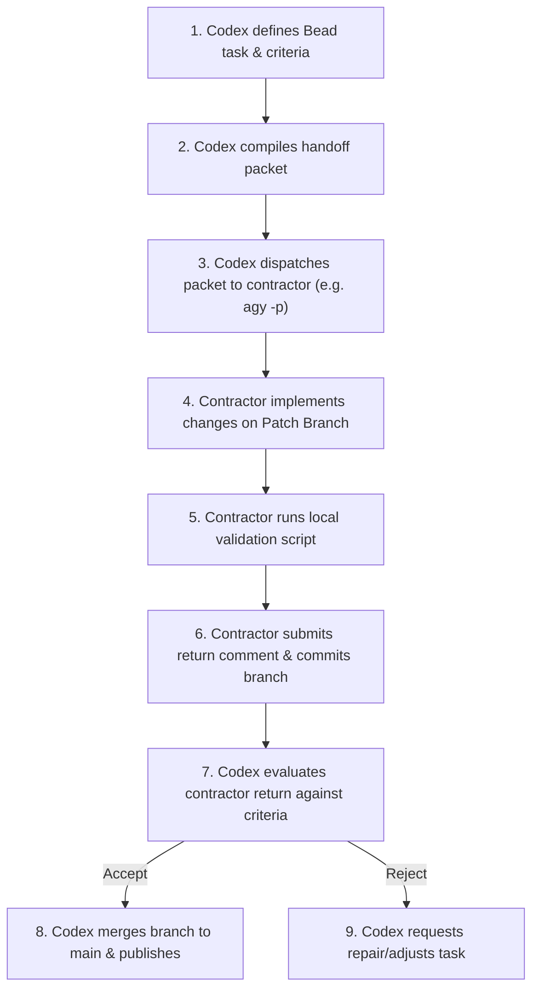

# Hello World Contractor Demo: Project Guide

This guide describes the architecture, key concepts, and operational workflows of the hello-world contractor demo.

---

## 1. Key Concepts

To understand the lifecycle of tasks in this repository, we define the following core terms on first use:

*   **Codex**: The agentic AI orchestration system (developed by Google DeepMind) that acts as the principal architect, project manager, and integrator. Codex plans the work, writes the baseline, dispatches tasks, and evaluates returns.
*   **Beads (`bd`)**: A lightweight task tracking and durable state management system used by Codex to model project dependencies, record task status, and log contractor dispatch and return evidence.
*   **Beads Task Graph**: A directed acyclic graph (DAG) of project tasks managed in Beads, showing how implementation, documentation, and publishing tasks depend on one another.
*   **Contractor Handoff Packet**: A JSON-formatted prompt containing context, allowed file paths, a job description, and acceptance criteria compiled by Codex to brief an external contractor tool.
*   **Outside Model Contractor**: An autonomous agent (such as Google Antigravity or Claude Code) invoked via specific tool commands (e.g., `agy -p` or `claude -p`) to complete a specific task in isolation.
*   **Patch Branch**: A dedicated Git branch (e.g., `agy/docs` or `claude/pages`) assigned to an outside contractor. Contractors are restricted to editing specific allowed paths on their patch branches.
*   **Validation Checkpoint**: An automated check run locally and during CI to ensure the repository remains in a valid, deployable state prior to merging code changes.

---

## 2. Directory Structure and Architecture

The repository is designed to be dependency-free, relying on standard browser technologies and built-in Python tools:

```
├── .github/              # CI/CD configuration (GitHub Actions workflows)
├── docs/                 # Documentation directory
│   └── project-guide.md  # This document (detailed architecture and workflow guide)
├── scripts/              # Validation and check scripts
│   └── check_site.py     # Static validation checker
├── index.html            # Main application static landing page
├── styles.css            # Styling rules for index.html
├── AGENTS.md             # Guidelines and instructions for agent contractors
├── CLAUDE.md             # Custom guidelines for Claude Code agent contractor
├── LICENSE               # Open-source license file
└── README.md             # Project overview and entry-point documentation
```

*   **[index.html](file:///home/d00d/codex/hello-world-contractor-demo-agy/index.html)**: The application entry point. It contains simple semantic HTML to describe the project and workflow.
*   **[styles.css](file:///home/d00d/codex/hello-world-contractor-demo-agy/styles.css)**: Provides premium layout and styling using modern CSS practices.
*   **[scripts/check_site.py](file:///home/d00d/codex/hello-world-contractor-demo-agy/scripts/check_site.py)**: A Python script that parses the HTML using standard libraries to verify layout elements and content requirements without introducing external pip dependencies.

---

## 3. Local Development Workflows

### Running the App Locally

To test the application interactively, serve the repository contents locally. Serving the files via a local server rather than opening `index.html` directly from the filesystem ensures proper routing and protocol alignment.

Run the built-in Python HTTP server module to serve the repository on port 8000:

```bash
python3 -m http.server 8000
```

Once the server is running, open your browser and navigate to the local address to interact with the static site:

```
http://localhost:8000
```

### Validating Project Correctness

Before committing changes, submitting a contractor return, or merging code, you must execute the validation checkpoint. This ensures that no structural tags are broken, the CSS is correctly linked, required hero text is present, and no unresolved placeholder markers (like "TODO" or "PLACEHOLDER") remain.

Execute the following script from the repository root directory:

```bash
python3 scripts/check_site.py
```

If the script exits with no output, the validation succeeded. If it fails, it prints a specific error message and exits with a non-zero code.

---

## 4. Bounded Contractor Lifecycle

External contractor execution follows a strict boundary model to guarantee security, quality control, and codebase integrity:



### Contractor Boundary Rules

1.  **Branch Isolation**: Contractors must never write directly to `main`. All development happens on designated patch branches (`agy/docs` or `claude/pages`).
2.  **Path Restrictions**: Contractors are permitted to edit only the files explicitly listed in their Bead metadata's `allowed_paths`. For example, Google Antigravity is restricted to `README.md` and `docs/project-guide.md`.
3.  **Transient File Hygiene**: Do not commit local Beads databases, raw contractor packets, contractor returns, or transient orchestration audit files. These files pollute version history and can accidentally expose internal system metadata.
4.  **No Secrets or Destructive Commands**: Contractors must never attempt to access, generate, or rotate secrets, nor run destructive command flags.

---

## 5. Troubleshooting and FAQ

### What happens if validation fails with "placeholder text remains"?
Ensure you have removed all literal strings containing `TODO` or `PLACEHOLDER` from your code and documentation. The validation parser checks all file contents case-sensitively.

### Why is direct pushing to main disabled?
To prevent conflicting changes and ensure all contractor code is validated and peer-reviewed by Codex before integration, branch protection rules restrict commits to designated patch branches only.
