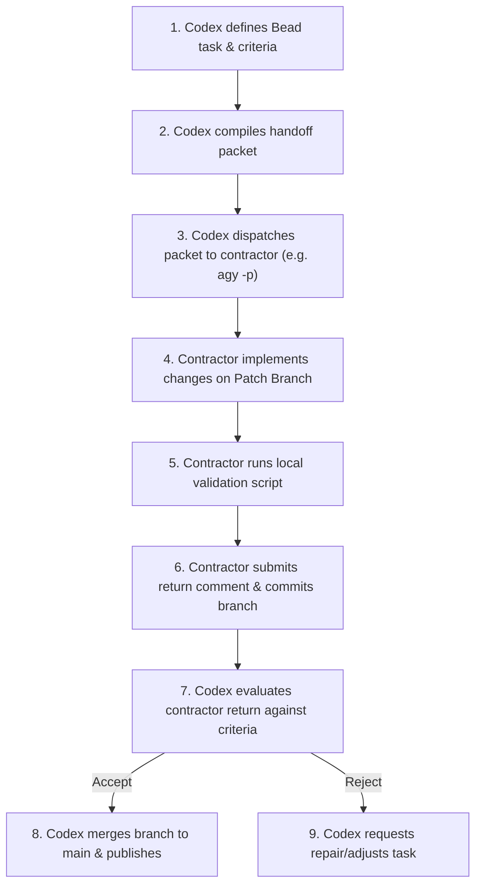

# Hello World Contractor Demo: Project Guide

This guide describes the architecture, key concepts, and operational workflows
of the hello-world contractor demo.

## 1. Key Concepts

To understand the lifecycle of tasks in this repository, we define the following core terms on first use:

- **Codex**: the AI coding agent acting as architect, project manager, integrator, and final reviewer.
- **Beads (`bd`)**: lightweight task tracking and durable state used to model project dependencies, record task status, and log contractor dispatch and return evidence.
- **Beads task graph**: a directed graph of project tasks showing how implementation, documentation, and publishing work depend on one another.
- **Contractor handoff packet**: a bounded prompt containing context, allowed file paths, a job description, and acceptance criteria for an external contractor tool.
- **Outside model contractor**: an external model tool, such as Google Antigravity or Claude Code, invoked with a specific assignment.
- **Patch branch**: a dedicated Git branch, such as `agy/docs` or `claude/pages`, where a contractor works inside assigned file boundaries.
- **Validation checkpoint**: an automated check run locally and in CI before merge or publish.

## 2. Directory Structure and Architecture

The repository is designed to be dependency-free, relying on standard browser technologies and built-in Python tools:

```
├── .github/              # CI/CD configuration (GitHub Actions workflows)
├── docs/                 # GitHub Pages and documentation
│   ├── index.html        # Published Pages entry point
│   ├── pages.css         # Published Pages styles
│   └── project-guide.md  # This architecture and workflow guide
├── scripts/              # Validation and check scripts
│   └── check_site.py     # Static validation checker
├── index.html            # Main application static landing page
├── styles.css            # Styling rules for index.html
├── AGENTS.md             # Guidelines and instructions for agent contractors
├── CLAUDE.md             # Custom guidelines for Claude Code agent contractor
├── LICENSE               # Open-source license file
└── README.md             # Project overview and entry-point documentation
```

- [index.html](../index.html): the application entry point.
- [styles.css](../styles.css): styling for the root landing page.
- [scripts/check_site.py](../scripts/check_site.py): a dependency-free Python validator for the root page and GitHub Pages entry point.

## 3. Local Development Workflows

### Running the App Locally

To test the application interactively, serve the repository contents locally. Serving the files via a local server rather than opening `index.html` directly from the filesystem ensures proper routing and protocol alignment.

Run the built-in Python HTTP server module to serve the repository on port 8000:

```bash
python3 -m http.server 8000
```

Once the server is running, open your browser and navigate to the local address to interact with the static site:

```
http://localhost:8000
```

### Validating Project Correctness

Before committing changes, submitting a contractor return, or merging code, run
the validation checkpoint. This ensures that structural tags are parseable, CSS
is linked, required text is present, and unresolved work markers are absent.

Execute the following script from the repository root directory:

```bash
python3 scripts/check_site.py
```

If the script exits with no output, the validation succeeded. If it fails, it prints a specific error message and exits with a non-zero code.

## 4. Bounded Contractor Lifecycle

External contractor execution follows a strict boundary model to guarantee security, quality control, and codebase integrity:



### Contractor Boundary Rules

1. **Branch isolation**: contractors must never write directly to `main`. All development happens on designated patch branches.
2. **Path restrictions**: contractors may edit only files explicitly listed in their Bead metadata's `allowed_paths`.
3. **Transient file hygiene**: do not commit local Beads databases, raw contractor packets, contractor returns, or transient orchestration audit files.
4. **No secrets or destructive commands**: contractors must never attempt to access, generate, or rotate secrets, nor run destructive command flags.

## 5. Troubleshooting and FAQ

### What happens if validation reports an unresolved marker?
Remove unfinished work markers from committed code and documentation, then run
`python3 scripts/check_site.py` again.

### Why is direct pushing to main disabled?
To prevent conflicting changes and ensure all contractor code is validated and peer-reviewed by Codex before integration, branch protection rules restrict commits to designated patch branches only.
